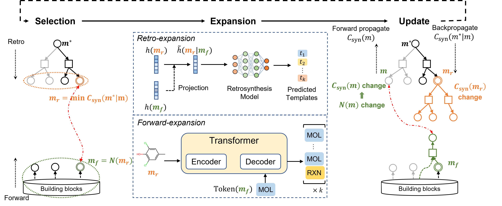

# CoBiSyn

## 📖 Introduction

This repository contains the official code and data for the paper **"CoBiSyn: A Bidirectional Search Framework for Chemical Synthesis Planning"**. We propose an effective search framework for chemical synthesis planning, which alternates between “backward decomposition” and “forward construction”,
while coordinating these two directions through shared frontier information.



## 📊 Usage

### Data Preparation

Download the relvent data and pre-trained models from [here]() and put them in current directory. 

The files are organized as follows:
```
├── checkpoints
│   ├── dist.ckpt   # SynDistModel
│   ├── fwd.ckpt    # ForwardModel
│   ├── pretrain.ckpt   # Base RetroModel (without fine-tuned by triplets)
│   └── retro.ckpt  # RetroModel (fine-tuned by triplets)
└── dataset
    ├── benchmarks  # test cases
    │   ├── pistachio_hard_targets.txt  # Pistachio Reachable
    │   ├── pistachio_reachable_targets.txt # Pistachio Hard
    │   └── uspto190.pkl    # USPTO-190
    ├── raw_data/   # reactions and pathways
    ├── bbs_emb.index   # faiss index of pre-computed query embeddings (SynDistModel)
    ├── bbs_fps.h5  # pre-computed Morgan fingerprints of building blocks
    ├── bbs_fps.index   # faiss index of fingerprints (ForwardModel)
    ├── building-blocks.pkl     # building blocks
    └── index2template.json     # templates

```

### Environment Setup

```
conda env create -f environment.yml -n cobisyn
conda activate cobisyn
```

### Model Evaluation

Taking USPTO-190 as examples:
```
python test.py  \
    --test dataset/benchmarks/uspto190.pkl \
    --dump results/results_uspto190.pkl \
    --device cuda:0
```
The results will be saved in `dump`. Other parameters can be found in `CoBiSyn/args.py`.

### Find Synthesis Pathway

To `run` interface of `CoBiSyn` class is used to find synthesis pathway for molecule specified in SMILES format.

``` python
from CoBiSyn.cobisyn import CoBiSyn

target = 'SMILES of a molecule'
solver = CoBiSyn()  # init relevant parameters

route = solver.run(target)

print(route.finish())   # whether success
print(route.success_route())    # identified route
```

If you want to perform on your own building blocks, you first need to create the corresponding FAISS index using `scripts/build_fp_index.py` and `scripts/build_emb_index.py`, then repeat the above process.